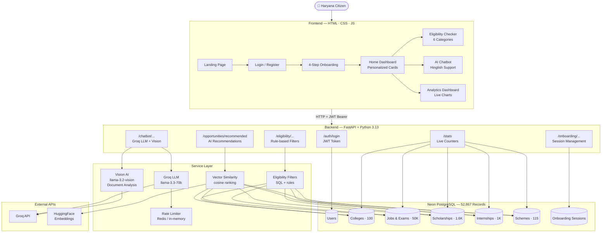

# HaryanaSarthi 🌾

**AI-powered portal to discover government opportunities — Schemes, Scholarships, Jobs, Exams, Internships & Colleges — personalized to your profile.**

***LIVE LINK : https://haryanasarthi.onrender.com

> Built for Haryana citizens. Powered by Groq LLM, Neon PostgreSQL, and Vector Similarity Search.

[](https://fastapi.tiangolo.com)
[](https://python.org)
[](https://neon.tech)
[](https://groq.com)

---

## Overview

HaryanaSarthi is a full-stack web application that helps Haryana citizens find government opportunities they are eligible for — all in one place. Users complete a short onboarding questionnaire, and the AI engine recommends personalized colleges, jobs, scholarships, internships, and schemes based on their age, category, education, location, and income.

---

## Architecture & User Flow



---

## Features

| Feature | Description |
|---|---|
| 🧠 **AI Recommendations** | Vector cosine similarity matching across 52,867 records |
| 💬 **Groq Chatbot** | Hinglish LLM responses using Llama-3.3-70b |
| 📄 **Document Analysis** | Upload documents for gap analysis (Llama-3.2-Vision) |
| 🗺️ **Haryana Map** | District-based opportunity filtering |
| 🔐 **JWT Authentication** | Secure login with bcrypt + BOLA object-level protection |
| 🎯 **Eligibility Checker** | Rule-based filters for all 6 opportunity categories |
| 📊 **Live Dashboard** | Real-time database counts and category charts |
| 🌙 **Dark Mode** | Full dark/light theme toggle |

---

## Tech Stack

| Layer | Technology |
|---|---|
| Backend | Python 3.13, FastAPI, SQLAlchemy 2.x (async) |
| Database | Neon PostgreSQL (asyncpg driver, SSL) |
| AI / LLM | Groq API — `llama-3.3-70b` (chat), `llama-3.2-vision` (docs) |
| Embeddings | HuggingFace Inference API → local hash fallback |
| Auth | JWT (HS256) + bcrypt (native, no passlib) |
| Cache / Rate Limiting | Redis → in-memory fallback |
| Frontend | Vanilla HTML, CSS, JavaScript |
| Charts | Chart.js |

---

## Dataset Summary

| Dataset | Records | Description |
|---|---|---|
| `Colleges_cleaned.csv` | 100 | Haryana colleges with admission criteria |
| `Job&Exam_cleaned.csv` | 50,000 | HSSC, SSC, and competitive exams |
| `internships_cleaned.csv` | 1,000 | Government internship programs |
| `haryana_scholarships_cleaned.csv` | 1,652 | NSP + Haryana state scholarships |
| `schemes_cleaned.csv` | 115 | Central and state welfare schemes |
| **Total** | **52,867** | |

---

## Project Structure

```
HaryanaSarthi/
│
├── .env                              # Environment variables (git-ignored)
├── DEVLOG.md                         # Full project development log
├── README.md
│
├── backend/
│   ├── main.py                       # FastAPI entry point + static file mount
│   ├── config.py                     # .env settings loader
│   ├── database.py                   # Sync + Async engines (Neon SSL handled)
│   ├── models.py                     # ORM table definitions (7 tables)
│   ├── schemas.py                    # Pydantic request/response models
│   ├── seed_data.py                  # Development user seeding
│   ├── requirements.txt
│   ├── routers/
│   │   ├── auth.py                   # Login + JWT issuance
│   │   ├── users.py                  # Profile + BOLA enforcement
│   │   ├── onboarding.py             # Session management (create/save/complete)
│   │   ├── opportunities.py          # AI recommendations endpoint
│   │   ├── eligibility.py            # 6-category eligibility checks
│   │   ├── chatbot.py                # Groq LLM + Vision document analysis
│   │   └── stats.py                  # Live database counters
│   ├── services/
│   │   ├── auth_service.py           # bcrypt hashing + JWT creation
│   │   ├── gemini_service.py         # Groq LLM, Vision, Embeddings
│   │   ├── redis_service.py          # Rate limiting (Redis + fallback)
│   │   ├── ml_recommender.py         # Cosine similarity vector search
│   │   ├── opportunity_service.py    # Recommendation orchestration
│   │   ├── eligibility_service.py    # SQL + vector hybrid filtering
│   │   ├── onboarding_service.py     # Session CRUD
│   │   └── dataset_loader.py         # CSV → PostgreSQL migration
│   ├── scripts/
│   │   └── generate_embeddings.py    # Batch embedding backfill
│   └── data/cleaned/                 # Source CSV datasets
│
└── frontend/
    ├── index.html                    # Landing page
    ├── auth.html                     # Login
    ├── home.html                     # Recommendations dashboard
    ├── dashboard.html                # Live stats + charts
    ├── profile.html                  # User profile
    ├── opportunities.html            # Browse all categories
    ├── pages/onboarding/             # 4-step onboarding flow
    ├── pages/eligibility/            # 6 eligibility checker pages
    ├── css/style.css                 # Dark theme design system
    └── js/script.js                  # All frontend logic + JWT handling
```

---

## Getting Started

### 1. Clone the Repository
```bash
git clone https://github.com/Gargi3012/HaryanaSarthi.git
cd HaryanaSarthi
```

### 2. Create Virtual Environment
```bash
python -m venv .venv
.venv\Scripts\activate        # Windows
source .venv/bin/activate     # macOS / Linux
```

### 3. Install Dependencies
```bash
pip install -r backend/requirements.txt
```

### 4. Configure `.env`
```env
DATABASE_URL=postgresql://<user>:<password>@<host>/neondb?sslmode=require
GROQ_API_KEY=gsk_...
JWT_SECRET_KEY=<64-character random hex string>
REDIS_URL=                    # optional — leave blank to use in-memory fallback
```

### 5. Start the Server
```bash
cd backend
uvicorn main:app --port 8000
```
- App: **http://localhost:8000/**
- Swagger Docs: **http://localhost:8000/docs**

---

## API Endpoints

| Method | Endpoint | Auth | Description |
|---|---|---|---|
| GET | `/` | — | Landing page |
| GET | `/stats` | — | Live database record counts |
| POST | `/auth/login` | — | Login and receive JWT token |
| GET | `/user/{user_id}` | ✅ JWT | User profile (BOLA protected) |
| POST | `/onboarding/session/create` | — | Create onboarding session |
| POST | `/onboarding/session/{id}/save-step` | — | Save step fields |
| GET | `/onboarding/session/{id}` | — | Read session state |
| POST | `/onboarding/session/{id}/complete` | — | Complete onboarding |
| GET | `/opportunities/recommended` | — | AI-ranked recommendations |
| POST | `/eligibility/colleges` | — | College eligibility check |
| POST | `/eligibility/jobs` | — | Job eligibility check |
| POST | `/eligibility/exams` | — | Exam eligibility check |
| POST | `/eligibility/internships` | — | Internship eligibility check |
| POST | `/eligibility/scholarships` | — | Scholarship eligibility check |
| POST | `/eligibility/schemes` | — | Government scheme eligibility |
| POST | `/chatbot/general` | — | AI chatbot (Hinglish) |
| POST | `/chatbot/analyze-document` | — | Document gap analysis (Vision) |
| GET | `/docs` | — | Swagger API documentation |

---

## Running Tests

```bash
# Full live test suite — 19 tests (server must be running on port 8000)
python backend/scratch/full_project_test.py
```

**Latest result: 19/19 PASSED ✅**

---

By Gargi Sharma
